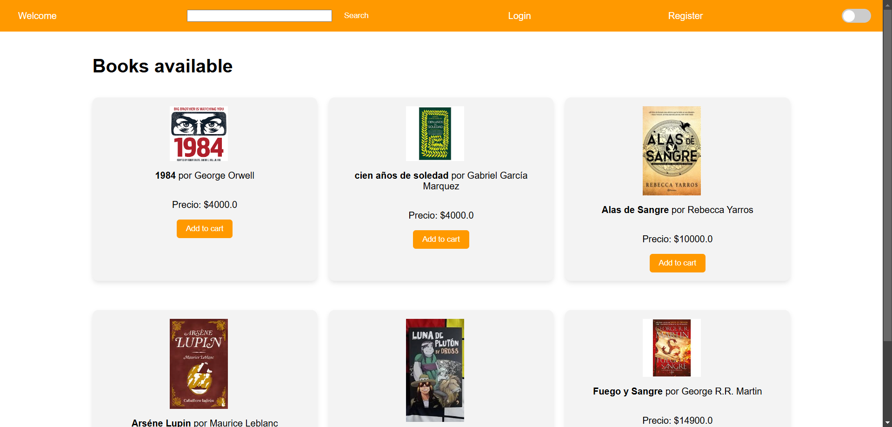
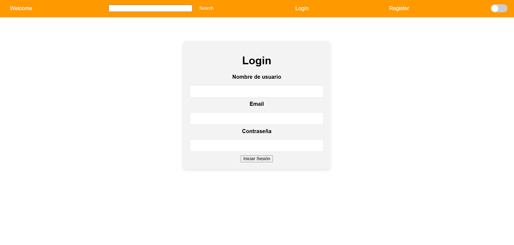
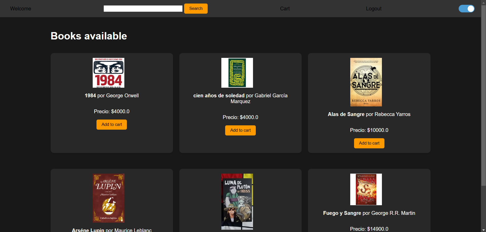

## Vista previa de la aplicación

### 

### 

### 

# Book Shop - Flask E-commerce Application

A web application for purchasing and managing a collection of books built with Flask. This project is designed to mimic a basic e-commerce store, allowing users to browse and search for books, add them to their cart, and manage purchases. Administrators have the ability to add new books to the store’s catalog.

## Features

- **User Authentication**: Users can register, log in, and log out securely.
- **User Roles**: Only admins can add new books to the catalog.
- **Book Catalog**: All users can browse and search for books.
- **Shopping Cart**: Users can add books to their cart, modify quantities, and view the total price.
- **Dark Mode**: Users can switch between light and dark modes; preferences are saved across sessions.
- **Responsive Design**: Optimized for a clean, user-friendly interface.

## Technologies Used

### Backend
- **Flask** - Web framework
- **Flask-SQLAlchemy** - ORM for database interaction
- **Flask-Login** - User authentication and session management
- **WTForms** - Form handling and validation
- **email-validator** - For email validation in forms

### Frontend
- **HTML** & **Jinja2** - Templating
- **CSS** - Styled with a theme inspired by Amazon's design
- **JavaScript** - Dark mode toggle and other dynamic elements

### Database
- **SQLite** - Local database to store users, books, and cart details
shop-flask
